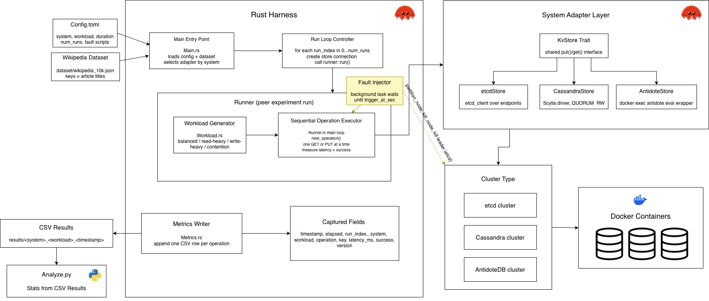

# kv-gauntlet

A Rust-based experiment harness for evaluating replication and consistency trade-offs across three real-world distributed key-value systems:

| System                                           | Consistency Model            |
| ------------------------------------------------ | ---------------------------- |
| [etcd](https://etcd.io)                          | Strong consistency (Raft)    |
| [Apache Cassandra](https://cassandra.apache.org) | Tunable consistency (Quorum) |
| [AntidoteDB](https://antidotedb.eu)              | Eventual consistency (CRDTs) |

This is not a simulator and not a new database. It is a controlled experiment harness that sends real workloads to real database clusters, injects faults, and records the results.

## Research Materials

Links to presentations and aggregated results from experiments using this harness:

- [Research Slides](https://docs.google.com/presentation/d/1Z3wcShy8ZU1ItjVFbGBbSK2yM9vBVbCdCC5v3BnO6_Y/edit?usp=sharing)
- [Data (TODO)](#)

---

## Purpose

This project is best understood as a lightweight, reproducible test harness for comparing how distributed key-value stores behave under load and failure conditions. It is especially useful for:

- Consistency analysis across different consistency models
- Fault tolerance testing (node failures, recovery)
- Performance benchmarking under realistic conditions with variable-length data

---

## Architecture


 
---

## How It Works

```
Rust Harness
  |
  v
System Adapter (etcd / Cassandra / AntidoteDB)
  |
  v
Real 3-Node Cluster (Docker)
  |
  v
CSV Metrics Output
```

The harness runs a configurable workload (reads and writes) against a real database cluster for a set duration. At a configured point during the run, a fault is injected: a node is killed via a shell script. Latency, success rate, and operation metadata are recorded in real time to a CSV file.

---

## Dataset

Experiments use a sample of 10,000 English Wikipedia articles. Article titles serve as keys and article text (first 500 characters) serves as values. This gives realistic variable-length values rather than synthetic uniform data.

To generate the dataset locally:

```bash
pip install datasets
python dataset/fetch_dataset.py
```

This creates `dataset/wikipedia_10k.json`. It is not committed to the repo.

Source: [HuggingFace/wikimedia/wikipedia](https://huggingface.co/datasets/wikimedia/wikipedia)

---

## Project Structure

```
kv-gauntlet/
├── src/
│   ├── main.rs           # Entry point, configuration loading
│   ├── config.rs         # Config file parsing
│   ├── runner.rs         # Experiment orchestration
│   ├── workload.rs       # Operation generation (deterministic)
│   ├── dataset.rs        # Wikipedia dataset loading
│   ├── metrics.rs        # Real-time CSV metrics writer
│   └── systems/
│       ├── mod.rs        # KvStore trait definition
│       ├── etcd.rs       # etcd adapter
│       ├── cassandra.rs  # Cassandra adapter (QUORUM consistency)
│       └── antidote.rs   # AntidoteDB adapter (CRDT via shell)
├── docker/
│   ├── etcd/             # Docker Compose for 3-node etcd cluster
│   ├── cassandra/        # Docker Compose for 3-node Cassandra cluster
│   └── antidote/         # Docker Compose for 3-node AntidoteDB cluster
├── scripts/
│   ├── etcd/             # start.sh, stop.sh, kill_node.sh
│   ├── cassandra/        # start.sh, stop.sh, kill_node.sh
│   └── antidote/         # start.sh, stop.sh, kill_node.sh
├── dataset/
│   └── fetch_dataset.py  # Dataset download script
├── results/              # CSV output (gitignored)
└── config.toml           # Experiment configuration
```

---

## Configuration

Edit `config.toml` to control the experiment:

```toml
# set to "etcd", "cassandra", or "antidote"
system = "cassandra"

# set to "balanced", "read-heavy", "write-heavy", or "contention"
workload = "balanced"
duration_seconds = 60
output_file = "results.csv"
num_runs = 3

# Optional: remove this section to run without fault injection
# set file path to match system (i.e "etcd", "cassandra", or "antidote")

[fault]
script = "scripts/cassandra/kill_node.sh"
trigger_at_seconds = 30
restore_script = "scripts/cassandra/restore.sh"
```

Remove or comment out the `[fault]` section to run without fault injection.

---

## Workload Types

| Workload    | Read % | Write % | Purpose                    |
| ----------- | ------ | ------- | -------------------------- |
| balanced    | 50     | 50      | General baseline           |
| read-heavy  | 95     | 5       | Read-dominant workload     |
| write-heavy | 5      | 95      | Write-dominant workload    |
| contention  | 5      | 95      | All writes to the same key |

---

## Running an Experiment

**1. Start the cluster for your system:**

```bash
./scripts/cassandra/start.sh
```

**2. Wait for all nodes to be ready:**

```
Starting cassandra cluster...
[+] Running 3/3
 ✔ cassandra3 Pulled                                                                                     2.2s
 ✔ cassandra1 Pulled                                                                                     2.2s
 ✔ cassandra2 Pulled                                                                                     2.2s
[+] Running 4/4
 ✔ Network cassandra_cassandra-net  Created                                                              0.0s
 ✔ Container cassandra1             Started                                                              0.3s
 ✔ Container cassandra2             Started                                                              0.3s
 ✔ Container cassandra3             Started                                                              0.3s
Waiting for Cassandra cluster to become ready...
Nodes up: 3/3
 ✔ cassandra1 (ready)
 ✔ cassandra2 (ready)
 ✔ cassandra3 (ready)

✔ Cluster is ready.
```

**3. Run the experiment:**

```bash
cargo run
```

**4. Results are written to (for each run conducted in the trial):**

```
results/<system>_<workload>_<timestamp>.csv
```

**5. Stop the cluster when done:**

```bash
./scripts/cassandra/stop.sh
```

---

## Metrics Output

Each row in the CSV represents one operation:

| Column          | Description                                                               |
| --------------- | ------------------------------------------------------------------------- |
| timestamp       | Clock time when operation executed                                        |
| elapsed_seconds | Seconds since experiment start                                            |
| run_index       | Sequential trial run number                                               |
| system          | Database system tested                                                    |
| workload        | Workload type                                                             |
| operation       | GET or PUT                                                                |
| key             | Wikipedia article title used as key                                       |
| latency_ms      | Operation latency in milliseconds                                         |
| success         | 1 if operation succeeded, 0 if failed                                     |
| version         | Version number written (PUT) or observed (GET); empty if operation failed |
| fault_active    | 1 if node failure was active during this operation, 0 otherwise           |

---

## Analyzing Results

Use `analyze.py` to aggregate metrics across multiple trial runs and compute statistics.

**Requirements:**

```bash
pip install pandas
```

**Example Usage:**

```bash
python scripts/analyze.py \
  --system cassandra \
  --workload balanced \
  --fault none \
  --inputs results/cassandra_balanced_20260416_210137.csv \
               results/cassandra_balanced_20260416_210243.csv \
               results/cassandra_balanced_20260416_210348.csv \
  --trial-results-out results/trials/cassandra_balanced_trials.csv \
  --scenario-summary-out results/trials/cassandra_balanced_summary.csv
```

**Arguments:**

`--system` (required): System name (etcd, cassandra, or antidote)

`--workload` (required): Workload type (balanced, read-heavy, write-heavy, or contention)

`--fault` (required): Fault type for documentation (e.g. none, node-kill, partition)

`--inputs` (required): One or more CSV files from experiment runs. Each file is treated as one trial.

`--trial-results-out`: Output file with per-trial metrics (default: trial_results.csv)

`--scenario-summary-out`: Output file with aggregated statistics across trials (default: scenario_summary.csv)

**Outputs:**

The script produces two files:

1. **Per-trial results**: One row per input file with metrics for that trial:
   - Stale read rate (fraction of reads that returned older data than written)
   - Availability during baseline vs. fault window (success rate)
   - Latency percentiles (p50, p99) for baseline vs. fault window
   - Total operations and stale reads
2. **Scenario summary**: One row with aggregated statistics (mean and standard deviation) across all trials for the scenario
   **Example Workflow:**

The trial results can be loaded into a spreadsheet for further analysis or visualization.

## Requirements

- [Rust](https://rustup.rs)
- [Docker Desktop](https://www.docker.com/products/docker-desktop/)
- Python 3
- Docker memory allocation: at least 8GB (Cassandra requires significant memory)

---

## System Adapters

Each database system implements the shared `KvStore` trait:

```rust
#[async_trait]
pub trait KvStore: Send + Sync {
    async fn put(&self, key: &str, value: &str) -> Result<(), StoreError>;
    async fn get(&self, key: &str) -> Result<Option<String>, StoreError>;
}
```

The runner only ever interacts with this trait, it has no knowledge of which database is underneath.

**Implementation notes:**

- **etcd**: Uses native KV API via Rust client
- **Cassandra**: Uses QUORUM consistency for all reads and writes
- **AntidoteDB**: Executes commands via Docker container and Erlang shell; uses LWW register CRDTs

---

## Known Limitations

- `concurrency` config parameter is defined but execution is currently single-threaded
- `output_file` config is not used; filenames are auto-generated as `<system>_<workload>_<timestamp>.csv`
- AntidoteDB integration uses shell-based command execution, making it less efficient than direct client libraries

---
